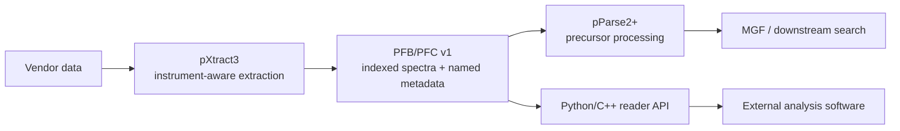

# Architecture and public boundaries

pPreProc is distributed as a preprocessing application and as a storage
interface. These are related but distinct public surfaces.

## 1. Standalone preprocessing application

The Windows entry point invokes the pParse2+ workflow and the pXtract adapters
required for the selected vendor input. It is the user-facing way to run the
validated pPreProc workflow without invoking the pFind search engine or GUI.
The present analytical validation covers DDA, including conventional DDA,
FAIMS-DDA, and dda-PASEF.

The standalone application boundary includes pPreProc executables, models,
configuration, and necessary data-access runtimes. pFind database search,
reporting, and unrelated utilities are excluded. Binary assets are released
only after all project and third-party redistribution terms are satisfied.
The historical application projects are available in the pFind 3.2.3
development tree but remain coupled to platform-specific build settings and
vendor data-access SDKs. They are therefore outside the initial
reader/specification source-package boundary pending a separate build and
licensing review; the compiled runtime asset remains distinguished from the
cross-platform reader and release-tool source stored in this repository.

## 2. PFB/PFC storage interface

PFB/PFC v1 is a versioned storage contract rather than a search-engine API.
PFB contains footer-indexed spectrum records; PFC provides the corresponding
named metadata rows. The representation does not impose a DDA precursor model.
Within the declared schema it can store spectra extracted from DDA or DIA data,
although DIA-specific pParse precursor processing is not yet claimed as
validated.

The dependency-free Python and header-only C++17 readers are cross-platform.
They provide direct ordinal access, `ScanNo` lookup, parent-MS1 traversal, and
strict validation of record boundaries, peak counts, and parent links. External
software can therefore read PFB/PFC without embedding pFind. MGF export remains
the compatibility path for tools that do not implement PFB/PFC.

## 3. Compatibility promises

- Indexed PFB/PFC files satisfying the v1 specification remain readable by all
  1.x reader releases.
- Additional PFC columns may be added without changing v1 readers; existing v1
  columns retain their meanings and units.
- An incompatible byte-layout change requires a new specification and explicit
  version discriminator.
- Historical unindexed PFB layouts are not silently guessed; they must be
  regenerated or migrated.
- Numerical-fidelity claims apply to represented peak arrays and declared PFC
  fields, not to unrepresented vendor-native metadata.

The publication and licensing boundary is defined in `RELEASE_MODEL.md`; the
audited source/binary origin is recorded in `SOURCE_PROVENANCE.md`.
